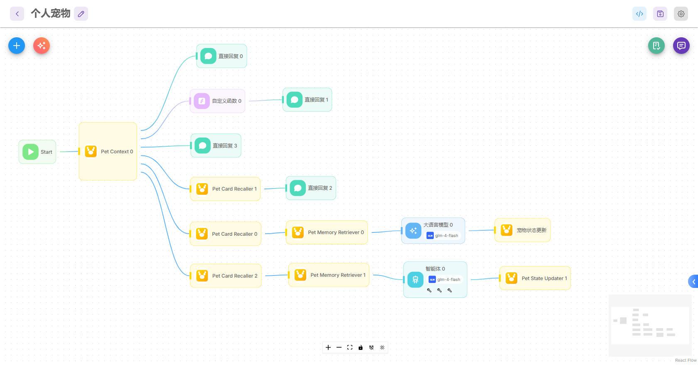
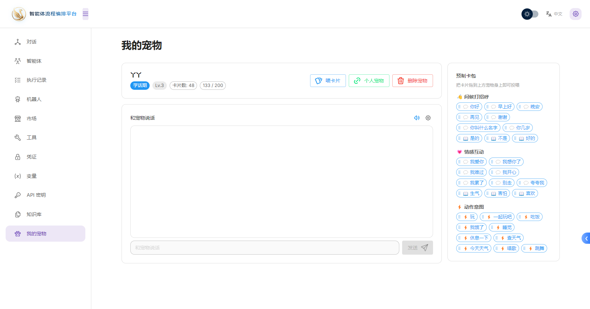

## 宠物智能体

<h3>基于 Flowise 进行二次开发并汉化</h3>

[English](README.md) | [简体中文](README.zh.md)

1. 流程编排



2. 宠物问答
   在 Flowise 上构建一只"有成长记忆的 AI 宠物"：从完全白纸出生，通过用户喂食**卡片**学习词汇/动作/风格，逐步涌现个性；达到一定程度后自动匹配并装配技能，最终成长为带独立人格、可调用工具、具备皮肤与语音的智能体。性格向量（8 维）：

| 索引 | 负向 ← 正向   | 含义      |
| ---- | ------------- | --------- |
| 0    | 活泼 ← → 沉稳 | 能量/节奏 |
| 1    | 好奇 ← → 谨慎 | 探索意愿  |
| 2    | 温和 ← → 直接 | 沟通风格  |
| 3    | 创意 ← → 务实 | 思维偏好  |
| 4    | 外向 ← → 内省 | 社交倾向  |
| 5    | 玩心 ← → 严肃 | 幽默感    |
| 6    | 共情 ← → 理性 | 情感取向  |
| 7    | 顺从 ← → 主见 | 自主性    |



## 扩展能力

1. 国际化
    - 支持中文、英文等多语言
2. 插件机制
    - 支持自定义节点、技能、插件等扩展

## ⚡Quick Start

Download and Install [NodeJS](https://nodejs.org/en/download) >= 18.15.0

1. Install Flowise
    ```bash
    npm install -g flowise
    ```
2. Start Flowise

    ```bash
    npx flowise start
    ```

3. Open [http://localhost:3000](http://localhost:3000)

### Docker Image

1. Build the image locally:

    ```bash
    docker build --no-cache -t flowise .
    ```

2. Run image:

    ```bash
    docker run -d --name flowise -p 3000:3000 flowise
    ```

3. Stop image:

    ```bash
    docker stop flowise
    ```

## 👨‍💻 Developers

Flowise has 3 different modules in a single mono repository.

-   `server`: Node backend to serve API logics
-   `ui`: React frontend
-   `components`: Third-party nodes integrations
-   `api-documentation`: Auto-generated swagger-ui API docs from express

### Prerequisite

-   Install [PNPM](https://pnpm.io/installation)
    ```bash
    npm i -g pnpm
    ```

### Setup

1.  Clone the repository:

    ```bash
    git clone https://github.com/FlowiseAI/Flowise.git
    ```

2.  Go into repository folder:

    ```bash
    cd Flowise
    ```

3.  Install all dependencies of all modules:

    ```bash
    pnpm install
    ```

4.  Build all the code:

    ```bash
    pnpm build
    ```

    <details>
    <summary>Exit code 134 (JavaScript heap out of memory)</summary>  
    If you get this error when running the above `build` script, try increasing the Node.js heap size and run the script again:

    ```bash
    # macOS / Linux / Git Bash
    export NODE_OPTIONS="--max-old-space-size=4096"

    # Windows PowerShell
    $env:NODE_OPTIONS="--max-old-space-size=4096"

    # Windows CMD
    set NODE_OPTIONS=--max-old-space-size=4096
    ```

    Then run:

    ```bash
    pnpm build
    ```

    </details>

5.  Start the app:

    ```bash
    pnpm start
    ```

    You can now access the app on [http://localhost:3000](http://localhost:3000)

6.  For development build:

    -   Create `.env` file and specify the `VITE_PORT` (refer to `.env.example`) in `packages/ui`
    -   Create `.env` file and specify the `PORT` (refer to `.env.example`) in `packages/server`
    -   Run:

        ```bash
        pnpm dev
        ```

    Any code changes will reload the app automatically on [http://localhost:8080](http://localhost:8080)

## 📖 Documentation

You can view the Flowise Docs [here](https://docs.flowiseai.com/)

## 📄 License

Source code in this repository is made available under the [Apache License Version 2.0](LICENSE.md).

## 其他

React 18 的 StrictMode 在开发模式下会故意将 useEffect 执行两次（挂载 → 卸载 → 重新挂载），以帮助发现副作用问题。这导致所有通过 useEffect 发起的 API 请求都被调用两次。

为什么 login 不受影响？
Login 是由用户点击按钮触发的（signIn.jsx:88 loginApi.request(body)），而不是 useEffect，所以不受 StrictMode 双调影响。

注意： 这只影响开发模式（npm run dev），生产构建中 effects 只执行一次。

## 激活插件的步骤（构建后执行一次）

1.  构建 flowise-pet-nodes 插件包

```
   cd packages/flowise-pet-nodes
   pnpm install
   pnpm build
```

2.  在 Flowise UI → Plugins 页面点击 "Install Plugin"
    Source: local
    Path: D:\workspace\Flowise\packages\flowise-pet-nodes

3.  激活后，可从 flowise-components/Pet 目录删除 4 个 agentflow 节点源文件

## 导入技能包扩展

业界没有 "OpenClaw" 的标准，我参照 Claude Code Skill + OpenAI Plugin manifest 设计如下（zip 包结构）：
my-skill.zip
├── manifest.json # 必须
└── entry/
├── handler.js # type=code 时使用
├── prompt.md # type=llm 时使用
└── api.yaml # type=api 时使用（任选其一）

-   仅接收 .zip / .json 文件,使用实例：

```json
{
    "name": "weatherSkill",
    "description": "Get current weather for a city",
    "type": "api",
    "inputs": [{ "property": "city", "type": "string", "required": true }],
    "config": {
        "url": "https://api.weather.com/v1?city=${city}",
        "method": "GET",
        "headers": { "Authorization": "Bearer ${vars.WEATHER_KEY}" }
    }
}
```

-   支持 python 技能包
    冷启动每次约 1–2s，热路径再快。如果未来要解决冷启动，可以考虑 sandbox 池化，但目前先保持简单。

## BGE-Small-Zh docker

```bash
docker pull flowise/bge-small-zh:latest

# 1. 拉取并运行 TEI 服务
docker run -d --name bge-small-zh -p 8081:80 -v D:\data\bge-cache:/data ghcr.io/huggingface/text-embeddings-inference:cpu-latest --model-id BAAI/bge-small-zh-v1.5

# 2. 验证服务是否启动成功
docker logs bge-small-zh

# 测试 embedding 接口
Invoke-RestMethod -Uri "http://localhost:8081/embed" `
  -Method POST `
  -ContentType "application/json" `
  -Body '{"inputs": ["你好，世界"]}'
```
